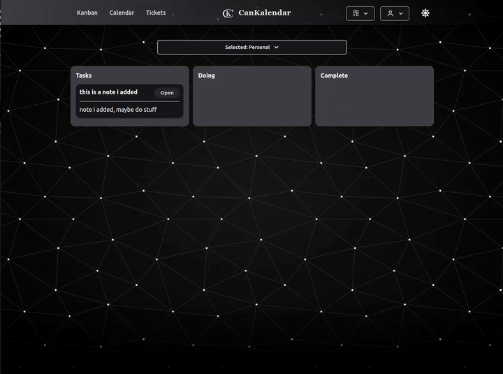

# Cankalendar

Cankalendar is a mix of functionality between a Kanban board and a calendar.
This project is a project management tool and that can be easily self-hosted using docker-compose to deploy the entire application stack.

## Preview



## Requirements:

- docker
- docker-compose

## Deployment

Deploy everything with:


```
git clone https://github.com/vadimstasiev/Cankalendar
cd Cankalendar
docker-compose up -d
```
